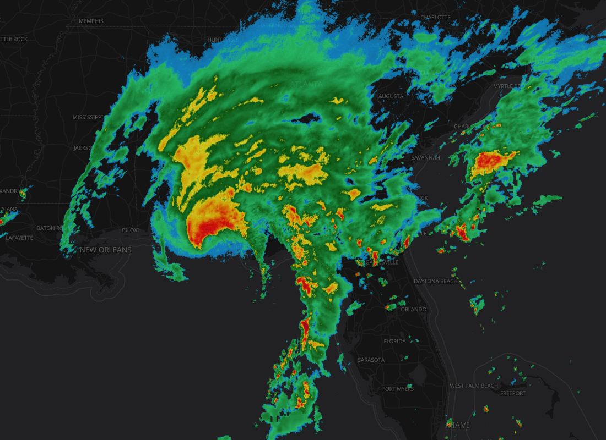
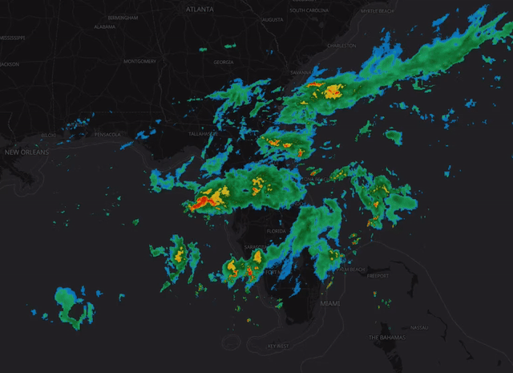
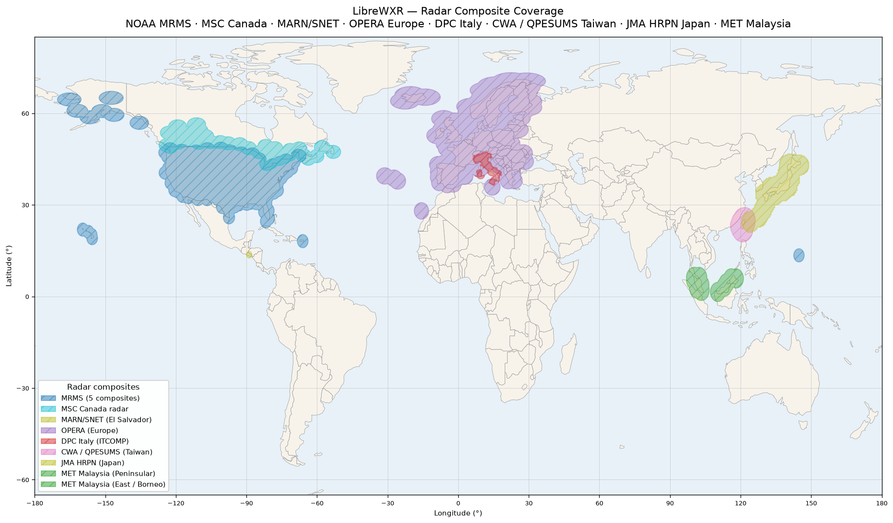
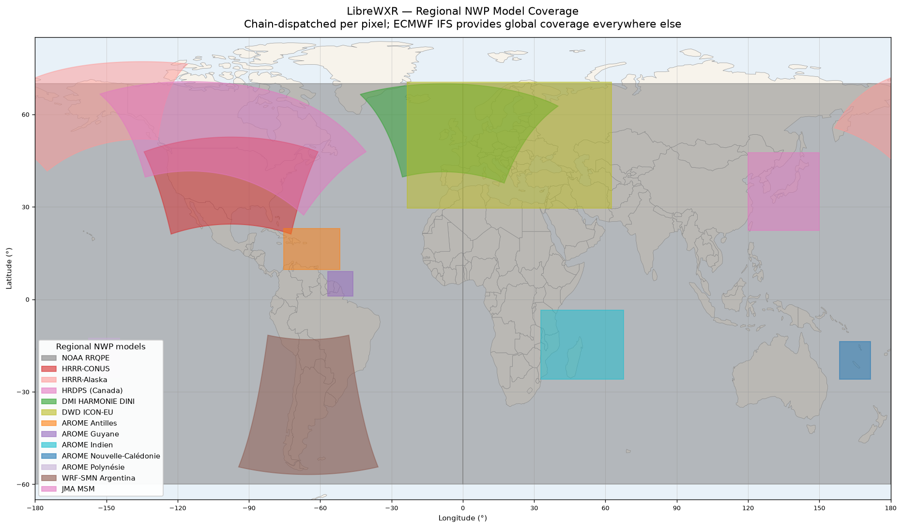

<p align="center">
  
</p>

# LibreWXR

A self-hostable, drop-in replacement for the [Rain Viewer](https://www.rainviewer.com/) API. LibreWXR serves weather radar tiles using freely available radar composite data from multiple sources, with full compatibility for any client built against the Rain Viewer v2 API.

<p align="center">
  <a href="LICENSE"></a>
  <a href="https://www.python.org/"></a>
  <a href="https://github.com/JoshuaKimsey/LibreWXR/actions/workflows/test.yml"></a>
  <a href="https://ko-fi.com/librewxr"></a>
</p>

<p align="center">
  
</p>

<p align="center">
  
</p>

## Why?

Rain Viewer recently (as of January 1st, 2026) restricted their free API tier. LibreWXR restores the full pre-restriction functionality as a free, self-hosted service:

| | Rain Viewer free tier | LibreWXR (self-hosted) |
|---|---|---|
| Max zoom level | 7 | 12 (configurable) |
| Color schemes | Universal Blue only | 15 schemes + raw grayscale |
| Satellite layer | None | Global (GOES / Meteosat / Himawari composite) |
| Forecast layer | None | 60-minute nowcast (radar extrapolation + NWP blend) |
| Image formats | PNG | PNG + WebP (configurable quality) |
| Permitted use | Personal / educational only | Your server, your terms (AGPL-3.0-or-later) |
| Uptime & rate limits | Best-effort, none guaranteed | Set by your own infrastructure |

<sub>Rain Viewer free-tier details as published at rainviewer.com/api, current as of October 2026.</sub>

Switching an existing client over? The [Rain Viewer → LibreWXR migration guide](docs/rainviewer-migration-guide.md) covers the two-line change most apps need.

Beyond compatibility, the goal is a far more customizable API backend for self-hosters — configurable regions, radar styles, denoising levels, and more — with no limits on what the API can ingest and output beyond what the implementation allows.

## Features

- **Rain Viewer v2 API compatible** — drop-in replacement, no client changes needed
- **All 15 color schemes** — Black & White, Rainviewer Original, Universal Blue, Titan, The Weather Channel (TWC), Meteored, NEXRAD Level III, Rainbow @ Selex SI, Dark Sky, Datameteo Valerio, Viper HD, MRMS CREF, 33/40 Max Storm, MetService NZ (Dark), Windy, plus raw grayscale
- **Tile sizes** — 256px and 512px
- **Image formats** — PNG and WebP (with configurable lossy/lossless quality)
- **Smoothing** — zoom-adaptive Gaussian blur with seamless tile boundaries
- **Multi-region coverage** — US (CONUS, Alaska, Hawaii, Puerto Rico, Guam) via NOAA MRMS quality-controlled mosaics with IEM fallback, Europe (OPERA pan-European composite, 184 radars across 27 countries) with the DPC Italian national composite (24 radars) filling Italy where OPERA's neighbour-radar fringe falls short, Canada (MSC GeoMet with MRMS blending), Central America (MARN/SNET El Salvador, 120 km), Taiwan (CWA QPESUMS 7-radar composite, 1.4 km observed dBZ), Japan (JMA HRPN gauge-corrected QPE from 20 C-band radars + AMeDAS), SE Asia (MET Malaysia 12-radar composite covering Peninsular Malaysia, Borneo, Brunei, Singapore, and N. Sumatra; PAGASA PANAHON 9-radar composite covering the Philippines), plus a global always-on observed bottom tier — NOAA RRQPE (Enterprise Rain Rate GLB-5, satellite-derived observed precipitation across the 60S-70N band) that fills past/current frames wherever no finer radar region claims the pixel
- **Regional NWP chain** — high-resolution rapid-refresh NWP models layered specificity-first: NOAA HRRR (CONUS + Alaska), ECCC HRDPS (Canada + N. CONUS), DMI HARMONIE-AROME DINI (most of populated Europe), DWD ICON-EU (the European remainder), JMA MSM (Japan + Korean Peninsula + Taiwan + Yellow Sea), SMN WRF-DET (Argentina + S. American Cone), and the full Météo-France AROME Outre-Mer family (Antilles, Guyane, Indien, Nouvelle-Calédonie, Polynésie), all on top of ECMWF IFS for global coverage. Soft-feathering at each domain edge prevents visible seams
- **Modular toggles** — every radar source, regional NWP, satellite channel, and the alerts feed has its own enable flag; master switches (`LIBREWXR_RADAR_ENABLED`, `LIBREWXR_REGIONAL_NWP_ENABLED`, `LIBREWXR_SATELLITE_ENABLED`) collapse whole layers in one line for satellite-only or nowcast-only deployments
- **Global observed precipitation animation** — within the 60S-70N band, the global precipitation animation comes from NOAA RRQPE (Enterprise Rain Rate GLB-5), an always-on observed satellite-derived radar region. ECMWF IFS 9 km model data powers the nowcast blend and fills the layer only poleward of the RRQPE band, in the 2-degree fringe excluded by RRQPE's coverage polygon, and when RRQPE declines (missed scans / stale store). Multi-timestep animation auto-scales to match radar history length
- **Optical flow interpolation** — hourly ECMWF IFS frames are interpolated to 10-minute steps using dense motion vectors, so IFS/model coverage animates smoothly like real radar data instead of jumping hour-to-hour (configurable, enabled by default); within the 60S-70N band the observed global precipitation animation comes from RRQPE's native 10-min scans, not interpolation
- **Precipitation nowcasting (experimental)** — 60-minute short-range forecast by extrapolating recent radar forward using optical flow, with configurable blend mode: smooth radar-to-model blending (default), pure radar extrapolation (closest to Rain Viewer), or pure NWP forecast. The model side is taken from the active NWP chain — HRRR over CONUS, ICON-EU/DINI over Europe, WRF-SMN over the S. American Cone, JMA MSM over Japan + adjacent East Asia, IFS elsewhere. Beyond 60 minutes, always uses pure model. Quality varies by weather pattern — works best for steady, organized precipitation; less reliable for fast-developing convection
- **Precipitation motion arrows** — optional Dark Sky-style arrows showing storm movement direction and speed, derived from optical flow. Available for both radar and ECMWF data globally. Supports light and dark styles for different map themes via `?arrows=light` or `?arrows=dark` query parameter
- **Real satellite imagery (GMGSI composite)** — NOAA's hourly global mosaic (GOES-East + GOES-West + Meteosat-9 + Meteosat-10 + Himawari-9, composited by NESDIS) ingested as longwave IR + visible channels and rendered as a VIS-over-LW composite with a natural day/night terminator crossfade. Day side shows continents and clouds as they appear from space; night side shows cold-cloud IR on a transparent basemap. Up to 12 hours of hourly animation with persistent disk caching. Populates the Rain Viewer-compatible `satellite.infrared` endpoint
- **Weather alerts (WMO CAP + NWS)** — global weather alerts polled every 5 minutes from severeweather.wmo.int, with MeteoAlarm geocodes for European polygon resolution. US alerts come directly from the NWS API, with zone-based alerts (e.g. Tornado Watches) resolved to zone polygons at ingest. Surfaced through a Rain Viewer-extension alerts API (`/v2/alerts/...`). Configurable via `LIBREWXR_ALERTS_ENABLED`
- **Snow detection** — per-pixel snow/rain classification. Regional NWP sources classify natively from their own 2-metre temperature field (HRRR-CONUS, HRRR-Alaska, WRF-SMN, DMI DINI, ICON-EU, JMA MSM); ECMWF IFS snowfall ratio fills everywhere else
- **Noise filtering** — configurable dBZ noise floor and speckle removal
- **Pipeline + render-worker architecture** — a data pipeline process fetches all radar / NWP / satellite / alerts data while one or more render workers serve tiles from a shared memmap snapshot. Split across processes so every core can render in parallel instead of being GIL-bound at one. `COMPOSE_PROFILES=multi` is the shipped default; a legacy `single` profile maps to one render worker with the legacy-single defaults
- **Persistent disk cache** — radar / NWP / satellite / alerts data are cached to disk with atomic writes, surviving restarts and container recreation without re-downloading from upstream. Configurable via `LIBREWXR_CACHE_DIR` (a per-host tempdir fallback is used, with a warning, when unset)
- **Memory-efficient storage** — radar frames, NWP grids, satellite frames, and nowcast data are all backed by memory-mapped files, letting the OS page cache manage physical RAM instead of pinning data on the heap. Pages are reclaimed under memory pressure and re-faulted on access
- **Smart fetch optimization** — radar sources skip re-downloading frames already in memory (only ~1 of 12 frames is new each cycle), NWP models skip redundant S3 fetches when the model run hasn't changed, and parallel NWP fetches are concurrency-capped via `LIBREWXR_NWP_FETCH_CONCURRENCY` so peak transient RAM stays bounded
- **Health endpoint** — `/health` for monitoring uptime, per-component memory breakdown, frame count, NWP chain status, alerts status, MCP mount state, and cache state, plus a `cluster` aggregation of per-worker stats in multi-worker deployments
- **MCP server** for AI agents — query precipitation nowcast and active weather alerts via Model Context Protocol. HTTP transport mounted at `/mcp` for n8n-style automation; stdio transport for local agents like Claude Desktop. See [MCP server](#mcp-server-librewxr-extension) below.
- **Storm-cell detection** — convective cells detected on radar frames each cycle via connected-component labeling at a configurable dBZ threshold. Overlay them on tiles with `?cells=light|dark` (parallel to `?arrows=`). See [Storm-Cell Detection](docs/storm-cells.md).
- **Fully configurable** — all tunable parameters exposed via environment variables

## Current Limitations

- **Limited radar coverage outside US / Canada / Europe / Central America / Taiwan / Japan / SE Asia** — real radar composites cover the US (CONUS, Alaska, Hawaii, Puerto Rico, Guam), Canada, El Salvador and its neighbours, Europe (via OPERA pan-European composite + DPC for Italy), Taiwan (CWA QPESUMS), Japan (JMA HRPN), Malaysia + Borneo + Brunei + Singapore + N. Sumatra (MET Malaysia), and the Philippines (PAGASA PANAHON). Within the 60S-70N band, the precipitation layer outside these radar domains is satellite-derived OBSERVED data (NOAA RRQPE, Enterprise Rain Rate GLB-5) — an IR-based estimate at 0.04° rather than radar-grade detail. Only poleward of the RRQPE band, in the fringe excluded by RRQPE's coverage polygon, and when RRQPE declines does the regional NWP chain on top of ECMWF IFS fill in — that's a complete picture of global precipitation, but those regions are modelled output, not direct radar observation
- **Experimental nowcasting** — precipitation nowcast uses optical flow extrapolation blended with whichever regional model is active in the active NWP chain (or ECMWF IFS where none is), which works well for steady, organized precipitation but is less reliable for fast-developing convection, cell initiation/dissipation, or complex terrain effects
- **Satellite is hourly, not real-time** — GMGSI publishes one composite per hour with tens of minutes of latency from observation. Native per-satellite feeds (GOES, Himawari, Meteosat) refresh every 5–15 minutes, but at the cost of seam-blending and reprojection work that GMGSI handles upstream. GMGSI also caps at ±72.7° latitude — the deep polar regions are out of frame

## Coverage

LibreWXR fuses native radar from regional networks across multiple
continents and layers a chain of high-resolution NWP models on top of
ECMWF IFS for global coverage.

**Radar composites:**



**Regional NWP models:**



Polygon shapes follow each grid's actual projected domain (LCC, polar
stereographic, LAEA, rotated lat/lon, or regular lat/lon) — not a
misleading lat/lon bounding box — so the curved edges visible on HRRR,
HRDPS, DMI DINI, OPERA, WRF-SMN, and JMA MSM are the real coverage
boundaries. See [`docs/coverage.md`](docs/coverage.md) for a labelled
breakdown of each polygon (resolution, projection, cycle cadence).
Regenerate both PNGs with
[`scripts/generate_coverage_map.py`](scripts/generate_coverage_map.py)
after adding or changing a radar source or NWP grid (the script header
documents the throwaway venv recipe).

### Radar regions

Fifteen radar composites — US (CONUS, Alaska, Hawaii, Puerto Rico, Guam), Canada, Central America, Europe (OPERA pan-European composite + DPC for Italy), Taiwan, Japan, Peninsular + East Malaysia, and the Philippines — plus the always-on global `RRQPE` observed band. Per-region codes, sources, resolutions, and station counts live in [`docs/coverage.md`](docs/coverage.md); what each region costs in frame memory is in [`docs/self-host-sizing.md`](docs/self-host-sizing.md).

Region groups: `CONUS`, `US`, `CANADA`, `CENTRAL_AMERICA`, `EUROPE`, `SOUTHEAST_ASIA`, `TAIWAN`, `JAPAN`, `ALL` — freely mixable with individual regions, e.g. `LIBREWXR_ENABLED_REGIONS=CONUS,EUROPE`.

### Regional NWP chain

LibreWXR layers regional NWP models on top of the global IFS layer using
a **specificity-first chain**: at each pixel, the chain dispatches to
the narrowest model whose domain covers it, falling through to wider
models elsewhere. Soft feathering at every domain edge prevents visible
seams where domains meet.

The full model-by-model table (coverage, resolution, projection, cycle cadence, and per-model toggles) is in [`docs/coverage.md`](docs/coverage.md); fine-tuning knobs (`LIBREWXR_*_PUBLISH_DELAY_MINUTES`, `LIBREWXR_*_DBZ_OFFSET`) and the default global-coverage recipe are in [`docs/configuration-reference.md`](docs/configuration-reference.md).

The active chain is logged at startup as `NWP chain: [...]` and surfaced under `/health` for verification.

## Quick Start

LibreWXR always runs as a data pipeline plus one or more render workers.
Docker Compose starts both services for you; the only thing to choose is
how many render workers to run. See [Deployment](#deployment) for the
full architecture.

### Docker

`docker-compose.yml` starts a `pipeline` service (fetches all data and
writes a shared snapshot) and a `renderer` service (serves tiles). Set
`COMPOSE_PROFILES=multi` in your `.env`:

```bash
git clone https://github.com/JoshuaKimsey/LibreWXR.git
cd LibreWXR
cp .env.example .env
# Edit .env — set COMPOSE_PROFILES=multi and size LIBREWXR_WORKERS to your box
docker compose up -d
```

The app reads `COMPOSE_PROFILES` to pick sensible defaults for worker
counts, cache sizes, thread pools, and memory limits. The multi defaults
target an 80-core / 32 GB rack (16 render workers, 12 GB pipeline cap,
18 GB render cap). Tune `LIBREWXR_WORKERS` and the
`LIBREWXR_PIPELINE_MEMORY` / `LIBREWXR_RENDER_MEMORY` env vars in
`.env` for smaller hardware — for a laptop or small VPS,
`LIBREWXR_WORKERS=1` or `2` is plenty.

`COMPOSE_PROFILES=single` still works as a legacy compatibility alias: it
starts the same two services with 1 render worker and the legacy-single
cache defaults, and logs a startup warning. See
[Single-Mode Migration](docs/single-mode-migration.md).

### Manual

Requires Python 3.11+.

```bash
git clone https://github.com/JoshuaKimsey/LibreWXR.git
cd LibreWXR
python3 -m venv .venv
source .venv/bin/activate
pip install .
# Optional extras:
#   pip install -e ".[mcp]"   # MCP server (AI agents, n8n, Claude Desktop)
cp .env.example .env
# Edit .env to taste
python -m librewxr.main
```

The server starts at `http://localhost:8080` by default. Run with no
flags, `main.py` auto-spawns the data pipeline as a child process and
runs this process as a render worker (1 uvicorn worker unless
`LIBREWXR_WORKERS` is set). It begins serving tiles immediately; radar
data loads in the background after startup.

For dedicated multi-process operation — an existing pipeline plus
separate render workers — run the data pipeline as a sidecar and start
the render workers with `LIBREWXR_RENDER_ONLY=1`:

```bash
export LIBREWXR_CACHE_DIR=/path/to/shared/cache    # recommended, shared

# Terminal 1 — data pipeline
python -m librewxr.data_pipeline

# Terminal 2 — tile-server worker pool
LIBREWXR_RENDER_ONLY=1 python -m librewxr.main
```

Both processes need the same `LIBREWXR_CACHE_DIR` pointed at a shared
directory. When it is unset, the app falls back to a per-host tempdir
(`<tmp>/librewxr-cache`) with a one-time warning.

### Auto-updating a Docker deployment

`scripts/auto-update.sh` is an optional helper for self-hosters running LibreWXR from a git checkout with `docker compose`. When run, it:

1. Fetches `origin` and checks whether the tracked branch has new commits.
2. If so, fast-forwards the working tree and runs `docker compose up -d --build` to rebuild and redeploy.
3. Otherwise exits quietly — it's safe to schedule via cron or a systemd timer.

The script is a **no-op by default** on any host. To opt in on a production host:

```bash
touch /path/to/LibreWXR/.auto-update-enabled
```

(Or export `LIBREWXR_AUTO_UPDATE=1` in the environment.) This sentinel is in `.gitignore`, so cloning the repo on a development machine will *not* accidentally enable auto-updates.

A typical cron entry for hourly updates:

```cron
0 * * * * /path/to/LibreWXR/scripts/auto-update.sh >> /var/log/librewxr-update.log 2>&1
```

Use `scripts/auto-update.sh --dry-run` to see what the script would do without making any changes; dry-run is always allowed regardless of the sentinel.

## Usage

### As a Rain Viewer replacement

Point any Rain Viewer-compatible client at your LibreWXR instance. The only change needed is replacing the Rain Viewer host URL with your LibreWXR URL.

For example, in JavaScript:

```javascript
// Before (Rain Viewer)
const apiUrl = "https://tilecache.rainviewer.com";

// After (LibreWXR)
const apiUrl = "http://localhost:8080";
```

### API Endpoints

#### Metadata

```
GET /public/weather-maps.json
```

Returns available radar timestamps and the host URL, matching Rain Viewer's response format:

```json
{
  "version": "2.0",
  "generated": 1773037528,
  "host": "http://localhost:8080",
  "radar": {
    "past": [{"time": 1773030600, "path": "/v2/radar/1773030600"}, ...],
    "nowcast": [{"time": 1773038400, "path": "/v2/radar/1773038400"}, ...],
    "colorSchemes": [{"id": 0, "name": "Black and White"}, {"id": 7, "name": "Rainbow @ Selex SI"}, ...]
  },
  "satellite": {"infrared": [{"time": 1773030600, "path": "/v2/satellite/1773030600"}, ...]}
}
```

#### Radar Tiles

```
GET /v2/radar/{timestamp}/{size}/{z}/{x}/{y}/{color}/{smooth}_{snow}.{ext}
```

| Parameter | Values | Description |
|---|---|---|
| `timestamp` | Unix timestamp | From the metadata endpoint |
| `size` | `256`, `512` | Tile size in pixels |
| `z` | integer | Zoom level |
| `x`, `y` | integer-valued strings | Standard slippy map tile coordinates — segments containing a dot are interpreted as lat/lon (see the Radar Point Tiles section) |
| `color` | `0`-`14`, `255` | Color scheme (see below) |
| `smooth` | `0`, `1` | Enable smoothing |
| `snow` | `0`, `1` | Enable snow precipitation colors |
| `ext` | `png`, `webp` | Image format |

**Optional query parameters:**

| Parameter | Values | Description |
|---|---|---|
| `arrows` | `light`, `dark` | Draw precipitation motion arrows (light for dark maps, dark for light maps) |
| `cells` | `light`, `dark` | Draw detected storm-cell markers (light for dark maps, dark for light maps) |

Ready-made integration snippets: see [`docs/web-integration-guide.md`](docs/web-integration-guide.md) and the [Examples](#examples) section below.

**Color schemes:**

<!-- BEGIN GENERATED: color-scheme-table -->
| ID | Name |
|---|---|
| 0 | Black and White |
| 1 | Rainviewer Original |
| 2 | Universal Blue |
| 3 | Titan |
| 4 | The Weather Channel (TWC) |
| 5 | Meteored |
| 6 | NEXRAD Level III |
| 7 | Rainbow @ Selex SI |
| 8 | Dark Sky |
| 9 | Datameteo Valerio |
| 10 | Viper HD |
| 11 | MRMS CREF |
| 12 | 33/40 Max Storm |
| 13 | MetService NZ (Dark) |
| 14 | Windy |
| 255 | Raw (grayscale) |
<!-- END GENERATED: color-scheme-table -->

#### Radar Point Tiles (Lat/Lon Windows)

A fixed-location variant of the radar tile endpoint, centered on an EPSG:4326 coordinate instead of a tile index:

```
GET /v2/radar/{timestamp}/{size}/{z}/{lat}/{lon}/{color}/{smooth}_{snow}.{ext}
```

| Parameter | Values | Description |
|---|---|---|
| `lat`, `lon` | decimal degrees | Image center; path segments containing a dot are treated as lat/lon, plain integer segments as x/y tile indices |
| `size` | `256`, `512` | Image size (intermediate values quantize: `< 512` becomes `256`) |

The center is snapped to the nearest pixel at that zoom; longitude wraps across the antimeridian and latitude clamps to the Web Mercator limit. Unknown timestamps return 404; no-data areas return a transparent 200 PNG; a timestamp of `0` aliases the latest frame, with the resolved timestamp returned in the `X-Frame-Timestamp` header. The `?arrows=` / `?cells=` parameters are tile-mode only; the coverage variant is `/v2/coverage/0/{size}/{z}/{lat}/{lon}/0/0_0.png`.

#### Satellite Tiles

```
GET /v2/satellite/{timestamp}/{size}/{z}/{x}/{y}/0/0_0.{ext}
```

| Parameter | Values | Description |
|---|---|---|
| `timestamp` | Unix timestamp | From `satellite.infrared` in the metadata endpoint |
| `size` | `256`, `512` | Tile size in pixels |
| `z`, `x`, `y` | integers | Standard slippy map tile coordinates |
| `ext` | `png`, `webp` | Image format |

Returns NOAA GMGSI satellite tiles: the daytime side shows visible reflectance (continents, oceans, sunlit clouds); the night side falls through to longwave IR. Hourly cadence, global between ±72.7° latitude.

#### Coverage Tiles

```
GET /v2/coverage/0/{size}/{z}/{x}/{y}/0/0_0.png
```

Returns tiles showing where radar data exists (white semi-transparent overlay). A lat/lon window variant is also available at `/v2/coverage/0/{size}/{z}/{lat}/{lon}/0/0_0.png` — see the Radar Point Tiles section for the dot rule and semantics.

#### Weather Alerts (LibreWXR extension)

```
GET /v2/alerts
GET /v2/alerts?lat={lat}&lon={lon}
GET /v2/alerts?bbox=west,south,east,north
```

Returns active weather alerts as a GeoJSON `FeatureCollection` carrying the alert polygon plus CAP metadata (severity, urgency, certainty, event, headline, sender, expiry) — fed by the WMO CAP feed (global) and the NWS API (US direct), with US zone-based alerts (e.g. Tornado Watches) resolved to zone polygons at ingest. Point queries (`lat`/`lon`) return containing alerts; `bbox=W,S,E,N` returns intersecting alerts; `simplify` sets polygon simplification in meters (default 1000, `0` = full resolution). Returns `503` if `LIBREWXR_ALERTS_ENABLED=false`.

#### Storm Cells (LibreWXR extension)

```
GET /v2/storm-cells
GET /v2/storm-cells?lat={lat}&lon={lon}&radius_km={radius}
GET /v2/storm-cells?format=json
```

Returns detected storm cells from the latest radar frame as a GeoJSON `FeatureCollection` (one `Point` feature per cell centroid; `format=json` returns a plain `{generated_at, cells}` payload instead). Each cell carries `area_km2`, `max_dbz`, `motion_speed_kmh` / `motion_heading_deg` (null when no motion data), and `region`. `lat` + `lon` + `radius_km` (default 100) filter to a search radius. Returns `503` when storm-cell detection is disabled.

#### Health

```
GET /health
```

Returns server status, frame count, cache usage, NWP chain state, satellite cache state, alerts status, MCP mount state, and per-component memory breakdown, plus a `cluster` aggregation of per-worker stats in multi-worker deployments.

#### MCP Server (LibreWXR extension)

LibreWXR exposes an [MCP (Model Context Protocol)](https://modelcontextprotocol.io/) endpoint for AI agents and automation pipelines. Three tools are available:

- `get_precip_nowcast(lat, lon, minutes=60)` — returns future precipitation frames (up to 60 minutes ahead) with dBZ, rain rate (mm/h), data source (`radar` | `nwp` | `none`), blend weight, and coverage (`in_range` | `out_of_range`).
- `get_active_alerts(lat, lon, radius_km=25, severity=None)` — returns a GeoJSON FeatureCollection of alerts within `radius_km` from the merged WMO + NWS store; US zone-based alerts (e.g. Tornado Watches) are resolved to zone polygons at ingest. Returns an empty collection when alerts are disabled or none match; never raises.
- `get_storm_cells(lat, lon, radius_km=100)` — returns a list of detected storm cells within `radius_km` of the point. Each cell dict: `{lat, lon, area_km2, max_dbz, motion_speed_kmh, motion_heading_deg, region}`. Returns an empty list when detection is disabled or no cells are within range; never raises.

The endpoint is mounted at `LIBREWXR_MCP_PATH` (default `/mcp`) when the `[mcp]` extra is installed and `LIBREWXR_MCP_ENABLED=true` (the default). Failures (missing extra, build error) are silently skipped so the REST API still boots; the `/health` endpoint surfaces the actual mount state as `mcp: {enabled, mounted, path, tools}`.

Two transport modes:
- **HTTP (primary, default, for n8n / hosted agents):** POST a JSON-RPC `initialize` request to `<public_url>/mcp`, then call tools via JSON-RPC `tools/call`. The HTTP transport is stateless — each request is self-contained, no `Mcp-Session-Id` is required, and any render worker can serve any request (what makes multi-worker deployments behind a load balancer work).
- **stdio (for local agents like Claude Desktop):** run the `librewxr-mcp` console entry. Requires `LIBREWXR_CACHE_DIR` pointing at the same shared volume the data pipeline (auto-spawned by `librewxr.main`) writes `state.json` into.

See [`docs/mcp-server.md`](docs/mcp-server.md) for full install instructions, transport configuration, example client configs (Claude Desktop, n8n), and the tool reference.

Instances self-describe via `/.well-known/ai-catalog.json` and `<mcp path>/server-card` (SEP-2127 draft) — see [docs/mcp-server.md#discovery](docs/mcp-server.md#discovery).

## Configuration

All settings are configured via environment variables (or a `.env` file). Copy `.env.example` to `.env` and adjust as needed. Every setting has a sensible default, so the service boots with zero configuration:

```bash
LIBREWXR_PUBLIC_URL=https://radar.example.com   # advertised in metadata responses
LIBREWXR_CACHE_DIR=/var/lib/librewxr            # persistent disk cache shared by pipeline + renderers
LIBREWXR_ENABLED_REGIONS=ALL                    # radar regions to enable (see [Coverage](#radar-regions))
LIBREWXR_WORKERS=8                              # render workers, ideally one per physical core
```

Per-source toggles — every radar source, regional NWP model, satellite channel, and the alerts feed — all default to `true`; sources enable by convention, so you only turn off what you don't need.

The full surface (every `LIBREWXR_*` variable with type, default, and range — including per-source NWP publish delays, dBZ calibration offsets, and source base URLs) lives in [`docs/configuration-reference.md`](docs/configuration-reference.md), with inline comments in [`src/librewxr/config.py`](src/librewxr/config.py). See `.env.example` for detailed descriptions and tuning guidance for each setting.

## Deployment

LibreWXR runs as a data pipeline plus one or more render workers,
sharing state via memmap files + a `state.json` snapshot on a shared
volume. Docker Compose starts both for you; the `pipeline` and
`renderer` services both belong to the `multi` profile (a legacy
`single` profile starts the same pair). The process layout and data
flow diagrams are in [Architecture](#architecture) below.

```bash
# In .env
COMPOSE_PROFILES=multi

# Then:
docker compose up -d
```

For a laptop, small VPS, or home server, keep the same architecture but
run fewer render workers (`LIBREWXR_WORKERS=1` or `2`). Bare metal,
`python -m librewxr.main` auto-spawns the pipeline and runs one render
worker unless `LIBREWXR_WORKERS` is set.

Tiles are served with `Cache-Control: public, max-age=300`, so any caching
reverse proxy or free-tier CDN works out of the box — for most
self-hosting scenarios, one worker behind Cloudflare is sufficient. RAM
and scaling tables (per-worker-count and per-audience) live in
[`docs/self-host-sizing.md`](docs/self-host-sizing.md). Coming from the
removed one-process deployment: [`docs/single-mode-migration.md`](docs/single-mode-migration.md).

## Architecture

### Process layout

The data pipeline fetches and stores everything; the render side scales
to N worker processes that each map the same files, so 32 workers don't
cost 32× the radar/NWP RAM — just the per-worker tile cache and Python
interpreter overhead.

```
┌────────────────────────────────────────┐    ┌────────────────────────────────────────┐
│   data-pipeline                        │    │   tile-server                          │
│   (one asyncio process)                │    │   (N uvicorn workers,                  │
│                                        │    │    LIBREWXR_RENDER_ONLY=1)             │
│   [radar / NWP / sat / alerts]  ──┐    │    │                                        │
│                                    │   │    │       ┌──> Worker 1 ─┐                 │
│   [Fetchers] ──> [Memmap stores +  │   │    │       ├──> Worker 2 ─┤                 │
│                   state.json       │   │    │       ├──> Worker 3 ─┼──> tiles + API  │
│                   snapshot]        │   │    │       ├──> ...      ─┤                 │
│                                    │   │    │       └──> Worker N ─┘                 │
└────────────────────────────────────────┘    │       (each polls state.json mtime and │
                  │                           │        re-loads stores on change)      │
                  │                           └────────────────────────────────────────┘
                  │                                            │
                  └──────────── shared volume (LIBREWXR_CACHE_DIR) ────────────┘
                                  (memmap files + state.json)
```

This is the right architecture for any deployment — the pipeline/render
split hands one core to each render process instead of serializing the
render path through a single process's GIL, and a fetch crash in the
pipeline no longer takes the tile server down. Production observation on
an 80-core / 32 GB rack: ~16 GB total RSS, all cores active under load.

### Data flow

```
[MRMS / IEM]       ──┐
[MSC Canada]       ──┤
[MARN El Salvador] ──┤
[OPERA / DPC]      ──┼──> [Radar Frames (memmap)] ───┐
[CWA / JMA HRPN]   ──┤     (N frames, multi-region)  │
[MET Malaysia]     ──┤                                │
[PAGASA]           ──┘                                │
                                                      │
[HRRR / HRRR-AK]   ──┐                                ├──> [Nowcast Store (memmap)]
[HRDPS]            ──┤                                │     (radar extrap + NWP blend,
[DMI DINI]         ──┤   ┌─> [NWP Chain (memmap)] ───┤      6 frames / 60 min)
[ICON-EU]          ──┼───┤    (per-source feather +   │
[AROME-OM family]  ──┤   │     specificity-first      │
[WRF-SMN]          ──┤   │     blending)              ├──> [FastAPI + Tile Renderer]
[JMA MSM]          ──┤   │                            │      (per-worker LRU cache)
[ECMWF IFS]        ──┘   │                            │
                          │                            │
                          └─> [Optical Flow Interp] ───┤      [Satellite Tile Renderer]
                              (hourly → 10-min)        │       (VIS-over-LW composite)
                                                       │
[NOAA GMGSI S3] ─> [LW + VIS frames] ──> [Disk Cache] ─┤
   (hourly global mosaic)                (atomic writes)│
                                                       │
[WMO CAP] ───────> [Alert Store] ──────────────────────┘
   (severeweather.wmo.int + MeteoAlarm geocodes)
```

All stores are memmap-backed — the OS page cache manages physical RAM
and pages are reclaimed under pressure, so total resident set scales
with what's actually being touched, not with what's loaded.

### Adding a new source

Every radar composite and regional NWP grid lives as a self-contained
package under `src/librewxr/sources/` and is auto-discovered at startup.
Adding a new source means creating one directory; the discovery walker
handles registration, so `data/fetcher.py`, `data/regions.py`, and
`data/coverage.py` need no edits.

See [`docs/adding-a-source.md`](docs/adding-a-source.md) for the full
walkthrough — directory layout, provider function shapes, the
country-dir convention, station / range overrides, NWP priority
numbers, worked examples, and a final PR checklist.

## Data Sources

All sources are provided by government-funded institutions and are
freely available for any use. No external dependencies beyond pip — no
GDAL, rasterio, or system geo libraries needed.

### Radar

- **[NCEP MRMS](https://www.ncep.noaa.gov/products/mrms/)** — MultiSensor/3DReflectivity quality-controlled mosaics covering the US plus Canadian radar ingest. 2-min cadence; default source for North American regions. Falls back to IEM NEXRAD N0Q if MRMS is unavailable (`LIBREWXR_NA_SOURCE`).
- **[Iowa Environmental Mesonet (IEM)](https://mesonet.agron.iastate.edu/)** — NEXRAD N0Q composite radar imagery (US regions, legacy fallback for MRMS).
- **[ECCC MSC GeoMet](https://eccc-msc.github.io/open-data/msc-geomet/readme_en/)** — Canadian weather radar composite (RADAR_1KM_RRAI via WMS) — pre-colored PNG decoded via palette reverse-engineering back to dBZ. MRMS blending fills gaps in northern Canada and the Atlantic coast.
- **[MARN / SNET](https://www.snet.gob.sv/)** — Servicio Nacional de Estudios Territoriales (Ministerio de Medio Ambiente y Recursos Naturales, El Salvador), San Andrés 120 km radar product via anonymous Google Cloud Storage. 5-min cadence, covering all of El Salvador + western Honduras + southern Guatemala + offshore Pacific. Continuous HSV hue gradient decoded back to dBZ. Reproduced with attribution per MARN's open-data permission.
- **[EUMETNET OPERA](https://www.eumetnet.eu/activities/observations-programme/current-activities/opera/)** — Pan-European CIRRUS radar composite via [MeteoGate](https://meteogate.eu/) S3. ODIM HDF5, 3800×4400 at 1 km (LAEA), 184 radars across 27 countries.
- **[DPC Radar (Italy)](https://radar-api.protezionecivile.it/)** — Dipartimento della Protezione Civile national VMI composite via the open Radar-DPC v2 REST API. Cloud-Optimized GeoTIFF, 1200×1400 at 1 km (spherical Transverse Mercator), 24 radars (11 DPC-direct + 13 partner), 5-min cadence. Wins precedence over OPERA wherever it covers, because Italy is not in the EUMETNET OPERA station list. Licensed under [CC-BY-SA 4.0](https://creativecommons.org/licenses/by-sa/4.0/) — attribution-share-alike (derivative tiles inherit the share-alike clause). Source: Dipartimento della Protezione Civile — Presidenza del Consiglio dei Ministri.
- **[CWA QPESUMS](https://www.cwa.gov.tw/)** — Central Weather Administration of Taiwan, 7-radar composite reflectivity product `O-A0059-001` via the `cwaopendata` AWS bucket. UTF-8 XML with raw dBZ at 1.4 km / 10-min cadence, covering Taiwan + a substantial western Pacific buffer for typhoon tracking. Filename timestamps are Taipei local time (UTC+8); data uses TWD67 datum (sub-pixel offset vs WGS84 at this resolution). Licensed under the [Open Government Data License v1.0](https://data.gov.tw/license) (資料來源：中央氣象署 / Source: Central Weather Administration, Taiwan).
- **[MET Malaysia](https://www.met.gov.my/)** — Jabatan Meteorologi Malaysia, 12-radar national composite (CAPPI 1 km, Rainbow 5 / LEONARDO Germany GmbH processing) via anonymous HTTPS at `api.met.gov.my`. 1352×570 animated GIF carrying 6 frames at 10-min cadence (~60 min of backfill per fetch), decoded via 18-stop palette → dBZ table. Split into `MYPENINSULAR` and `MYEAST` covering Peninsular Malaysia + N. Sumatra and East Malaysia (Borneo) + Brunei respectively. Singapore sits within `MYPENINSULAR`'s KLIA-radar coverage. Licensed under [CC-BY-4.0](https://creativecommons.org/licenses/by/4.0/) (Radar data © Jabatan Meteorologi Malaysia / METMalaysia).
- **[PAGASA](https://www.pagasa.dost.gov.ph/)** — Philippine Atmospheric, Geophysical and Astronomical Services Administration, 9-radar national mosaic via the PANAHON web app's anonymous CDN at `cdn.panahon.gov.ph`. JSON timeline endpoint returns 6 frames at 15-min cadence with explicit UTC timestamps, paired with 2048×2048 RGBA PNGs in EPSG:4326. Decoded via the JS bundle's exact 13-stop linear 0-75 dBZ palette. Single `PHCOMP` region covering Luzon + Visayas + Mindanao + W. Palawan + edges of Sabah / N. Sulawesi. Public domain per Philippine IP code RA 8293 §176 (government-works exception); attributed to PAGASA / DOST.
- **[JMA HRPN](https://www.jma.go.jp/bosai/nowc/)** — Japan Meteorological Agency High-Resolution Precipitation Nowcast (気象庁ナウキャスト), 20 C-band Doppler radars + AMeDAS rain-gauge network composited as gauge-corrected QPE. Analysis leg only (radar composite); JPCOMP nowcast frames come from LibreWXR's internal optical-flow extrapolation blended with JMA MSM as the regional NWP overlay. Licensed under the [JMA Public Data License v1.0](https://www.jma.go.jp/jma/en/copyright.html) (CC-BY equivalent, commercial reuse permitted with attribution). Source: Japan Meteorological Agency website ([jma.go.jp](https://www.jma.go.jp/)).

### Regional NWP models

Layered ahead of IFS via specificity-first dispatch (see the [Regional NWP chain](#regional-nwp-chain) table for domain coverage and toggles).

- **NOAA HRRR-CONUS** — 3 km LCC, 15-min subh, hourly cycles. Anonymous AWS Open Data.
- **NOAA HRRR-Alaska** — 3 km polar stereographic, hourly wrfsfcf, 3-hourly cycles. Anonymous AWS Open Data.
- **ECCC HRDPS-Continental** — 2.5 km rotated lat/lon, 6-hourly cycles. Anonymous HTTPS via `dd.weather.gc.ca`.
- **DMI HARMONIE-AROME DINI** — 2 km native LCC, 3-hourly cycles. Anonymous AWS Open Data; covers most of populated Europe.
- **DWD ICON-EU** — ~7 km, 3-hourly cycles. DWD opendata; fills the European gaps DINI doesn't reach.
- **Météo-France AROME Outre-Mer family** — five regional grids sharing one Météo-France upstream (anonymous via OVH Object Storage, ~7 h publish delay), 2.5 km native lat/lon, 4 cycles/day:
  - **AROME Antilles** (priority 25) — Guadeloupe + Martinique + eastern Caribbean
  - **AROME Guyane** (priority 26) — French Guiana
  - **AROME Indien** (priority 27) — Réunion + Mayotte + Madagascar + Comoros (the largest of the AROME-OM grids)
  - **AROME Nouvelle-Calédonie** (priority 28) — New Caledonia
  - **AROME Polynésie** (priority 29) — French Polynesia
- **SMN Argentina WRF-DET** — 4 km LCC, 4 cycles/day. Anonymous AWS Open Data; covers the South American Cone.
- **[JMA MSM](https://www.jma.go.jp/jma/en/Activities/nwp.html)** via [Open-Meteo](https://open-meteo.com/) — Japan Meteorological Agency Mesoscale Model (5 km native, Japan + Korean Peninsula + Taiwan + Yellow Sea), republished by Open-Meteo to anonymous AWS Open Data. The regional NWP overlay paired with the JPCOMP radar composite — fills the model side of the nowcast blend with a Japanese mesoscale forecast instead of falling through to global IFS. Licensed [CC-BY-4.0](https://creativecommons.org/licenses/by/4.0/); data provided by Open-Meteo.com.

### Global precipitation

- **[ECMWF IFS](https://www.ecmwf.int/)** via [Open-Meteo](https://open-meteo.com/) — ECMWF IFS 9 km global precipitation and snowfall. Marshall-Palmer Z-R conversion with snow/rain classification from snowfall ratio. Hourly frames optical-flow-interpolated to 10-min steps. The model base for precipitation animation and the nowcast blend outside the regional NWP chain — for past frames that means poleward of the RRQPE band, the fringe excluded by RRQPE's coverage polygon, and when RRQPE declines (within the band, NOAA RRQPE below provides the observed global animation). Licensed [CC-BY-4.0](https://creativecommons.org/licenses/by/4.0/); data provided by Open-Meteo.com.
- **[NOAA Enterprise Rain Rate (RRQPE)](https://registry.opendata.aws/noaa-ghe/)** — satellite-derived observed precipitation (IR-based estimate), NOAA NODD open data from the anonymous `noaa-enterprise-rainrate-pds` S3 bucket. The GLB-5 blend of geostationary IR rain estimates (inputs include GOES-East/West, EUMETSAT Meteosat-9/10, JMA Himawari-9), 10-min cadence, ~17-min publish latency, 60°S-70°N coverage, native 0.02° grid block-averaged to 0.04°. Because it is observed, not forecast, it serves past frames only — LibreWXR ingests it as a single global radar region at the bottom of the multi-region compositor, filling only pixels no finer radar claims, with the models answering future/nowcast times. Attribution requested: "Precipitation data from NOAA Enterprise Rain Rate (RRQPE)" — no endorsement implied; don't present modified data as unaltered NOAA data.

### Satellite

- **[NOAA GMGSI](https://registry.opendata.aws/noaa-gmgsi/)** — Global Mosaic of Geostationary Satellite Imagery, composited by NESDIS from GOES-East, GOES-West, Meteosat-9, Meteosat-10, and Himawari-9. Ingested as longwave IR + visible channels and rendered as a VIS-over-LW composite with natural day/night terminator. Anonymous AWS Open Data; hourly cadence; ±72.7° latitude coverage. Persistent disk cache survives restarts.

### Weather alerts

- **WMO CAP** at [severeweather.wmo.int](https://severeweather.wmo.int/) — global weather alerts with MeteoAlarm geocodes for European polygon resolution. Updates every 5 minutes; surfaced through a Rain Viewer-extension alerts API.

## Examples

The `examples/` directory contains three self-contained HTML files showcasing the LibreWXR feature set. Each file is a single, liftable artifact — copy it into your own project and it runs standalone, no build step required:

- **`leaflet.html`** — Leaflet-based weather map
- **`maplibre.html`** — MapLibre GL JS-based weather map
- **`widget.html`** — dependency-free radar widget built on the lat/lon-centered point-tile API

`hero.html` is a compact, config-locked variant of the Leaflet example used on the marketing site. The two map pages include:
- **Source selector** — switch between local (`localhost:8080`) and the public instance (`api.librewxr.net`) with auto-detection
- **Layer modes** — Radar, Satellite, or Radar + Satellite (satellite as background under radar)
- **Light/dark theme** — toggles both the base map and UI styling
- **Color scheme selector** — 15 color schemes plus a raw grayscale (255) option
- **Weather-alerts overlay** — severity-styled WMO alert polygons
- **Options panel** — collapsible controls for smoothing, snow mask, PNG/WebP output format, and 256/512px tile size with HiDPI auto-detection
- **Motion arrows** — off, light, or dark
- **Storm-cell markers** — cell detection with light/dark label styles
- **Scrubber bar** — draggable timeline with past/nowcast visual distinction and tick labels
- **Background preloading** — pre-renders all frames with a progress indicator for smooth animation
- **Keyboard shortcuts** — Space to play/pause, arrow keys to step through frames
- **Locate Me** — geolocate and zoom to your position
- **Auto-refresh** — metadata refreshes every 5 minutes to stay current

The `widget.html` page is different by design: no map library, no tile grid (with an optional toggleable OpenStreetMap background). It fetches the same `weather-maps.json` catalog, then asks the server for a single image rendered *centered on a chosen location* via the point-tile endpoint (`.../{size}/{z}/{lat}/{lon}/{color}/{smooth}_{snow}.png`). It animates past and nowcast frames with play/pause, preloads ahead, and shows the exact image URL in a click-to-copy box — the drop-in snippet for a RainViewer-style weather card, email, or iframe. Everything configurable sits in one commented block at the top of the script.

### Building / editing

The HTML files are generated — do not hand-edit them. Edit the modular sources in `examples/src/` and rebuild:

```bash
python3 examples/src/build.py           # regenerate all example pages
python3 examples/src/build.py --site    # also regenerate the published site variants
```

Each generated file carries a `GENERATED ... do not edit` header comment.

The map examples auto-detect whether to use your local server or the public instance based on how the file is opened. The widget instead ships an API-source selector in its controls, defaulting to the public instance.

## Supporters

LibreWXR is developed and maintained for free. If it has been useful to you, please consider supporting development via [Ko-Fi](https://ko-fi.com/librewxr), [Liberapay](https://liberapay.com/librewxr), or [PayPal](https://paypal.me/jkimsey95) - every bit helps keep development and hosting going.

With many thanks to those who have supported the project:

- [Dolphin Island Sea Lab - ARCOS](https://www.disl.edu/arcos)
- [Weather Gods](https://apps.apple.com/app/weather-gods/id1041512978)
- [Linecast](https://github.com/ashuttl/linecast)
- To the anonymous Ko-Fi donators: thank you!

## Who's Using LibreWXR

A sample of the projects and deployments built on the LibreWXR API:

| Project | Description |
|---|---|
| [Advanced Weather Widget](https://github.com/pnedyalkov91/advanced-weather-widget) | A modern, highly customizable weather widget built specifically for KDE Plasma 6. |
| [Aether](https://github.com/iamthegreatdestroyer/aether) | One app instead of four subscriptions: Windy-class weather, live aircraft, tides & buoys, trails, and forecast receipts that score themselves. |
| [Cirrus](https://github.com/woheller69/omweather) | Weather and rain radar for any location - worldwide. |
| [DailyWX](https://dailywx.com) | A daily weather game inside a fully featured weather app. |
| [Dolphin Island Sea Lab - ARCOS](https://www.disl.edu/arcos) | An educational initiative focused on collecting real-time environmental monitoring data for Mobile Bay. |
| [FlightScnr Pi](https://github.com/yashmulgaonkar/FlightScnr_Pi) | A round 4″ touch display flight and marine tracker for Raspberry Pi. |
| [Lea Hill Weather](https://lhwx.org) ([GitHub](https://github.com/johlym/leahillwx)) | Rails 8.1 app for lhwx.org: a live personal weather-station dashboard (home, reports, graphs, records, trends, almanac, radar). |
| [Linecast](https://github.com/ashuttl/linecast) | Weather, tides, the sun, the moon, and maps, drawn for the terminal. The Old Farmer's Almanac meets Minitel. |
| [LocalSky](https://github.com/silenthooligan/localsky) | Hyperlocal weather on your hardware. Smart irrigation when you want it. |
| [Merry Sky](https://merrysky.net) | A lightweight forecasting website providing an all-in-one hourly summary of the upcoming temperature, precipitations and more. |
| [Photo-Planner](https://apps.apple.com/de/app/photo-planner/id6764817751) | An app to visualize the field of view for selected cameras and lenses and overlay it onto a map. |
| [PiClock](https://github.com/n0bel/PiClock) ([PiClock3](https://github.com/n0bel/PiClock3)) | A Fancy Clock built around a monitor and a Raspberry Pi. |
| [Presura](https://presura.eu) | A multi-language weather viewer for the European Union. |
| [RidePilot](https://apps.apple.com/us/app/ridepilot-smart-bike-computer/id6790916720) | A cycling tracking app. |
| [Rueckenwind](https://rueckenwind.piepgras.de) | A cycling navigation app for iOS, built on BRouter and OpenStreetMap. |
| [SparkRadar](https://sparkradar.app) | A weather radar app with LibreWXR powering its International Mosaic layer. |
| [Silver Skies (Desktop)](https://github.com/poliberry/silverskies-desktop) | A desktop weather radar, forecast, and severe alert dashboard (Electron + Next.js). |
| [SkyMonitor](https://skymonitor.app) ([GitHub](https://github.com/chicagoeas/sky-monitor)) | SkyMonitor is a weather website that uses multiple APIs to get you the most accurate weather information for where you are! |
| [South Alabama Mesonet](https://mesonet.southalabama.edu) | A network of weather stations monitoring conditions across Southern Alabama. |
| [StormView Rewrite](https://github.com/arc360alt/StormView-Rewrite) | A rewritten version of stormview to be faster, lighter. |
| [Variable Weather](https://variablewx.librewxr.net) ([GitHub](https://github.com/JoshuaKimsey/variable-weather)) | Inspired by Breezy Weather, Variable Weather makes it easy and fun to get the weather information you need. |
| [ZeusWatch](https://github.com/SysAdminDoc/ZeusWatch) | A free, open-source Android weather app with a premium dark UI. No API keys required. |

Built something with LibreWXR? Head over to our [Discussions post](https://github.com/JoshuaKimsey/LibreWXR/discussions/29) to get listed.

## License

LibreWXR is licensed under the [GNU Affero General Public License v3.0](LICENSE) (AGPL-3.0-or-later). It is free to use, self-host, modify, and redistribute under those terms, and it always will be. Note that the AGPL's network-use clause (section 13) means that if you run a *modified* version of LibreWXR as a network service, you must make your modified source available to that service's users.

### Commercial licensing

The AGPL is the right fit for the open project and the self-hosting community. But its copyleft and network-use obligations are incompatible with some commercial uses — for example, building LibreWXR into a closed-source product, or running a hosted service on top of it whose modifications you can't release.

If that describes your use case, a separate commercial license is available that lifts the AGPL obligations. This changes nothing about the open project: LibreWXR stays AGPL-licensed and free for everyone else. Reach out to <jkimsey@proton.me> to discuss terms.

## Star History

[](https://www.star-history.com/?repos=joshuakimsey%2Flibrewxr&type=date&legend=bottom-right)
