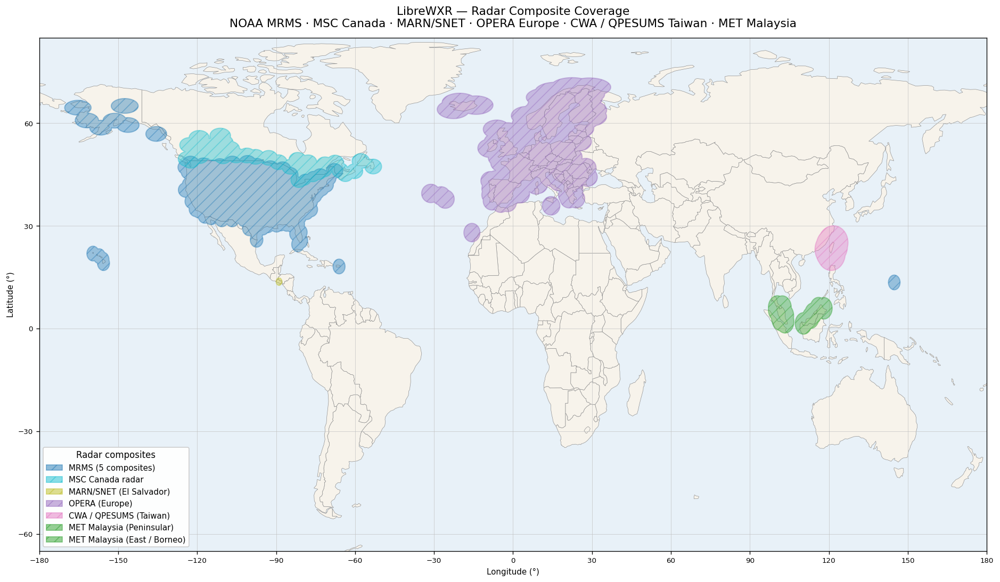
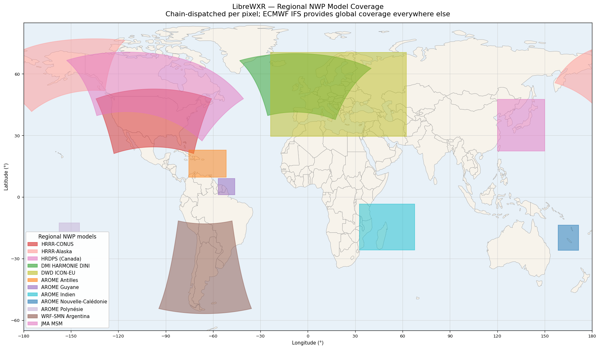

# LibreWXR — Coverage Maps

Visual reference for the radar composites and regional NWP grids
LibreWXR fuses into its tiles.

**ECMWF IFS is not drawn.** IFS provides 9 km global coverage as the
base of the NWP chain — it covers every pixel everywhere, so showing
it as a polygon would just paint the whole map. The two maps below
highlight where the regional chain wins over the global IFS layer.

Polygon shapes follow each grid's actual projected domain (LCC, polar
stereographic, LAEA, rotated lat/lon, or regular lat/lon) — not a
lat/lon bounding box — so the curved edges visible on HRRR, HRDPS,
DMI DINI, OPERA, and WRF-SMN are the real coverage boundaries the
fetcher and renderer respect.

---

## Radar composites



| Source | Coverage | Cadence | Resolution |
|---|---|---|---|
| NOAA MRMS — CONUS | Continental US | 2 min | ~0.005° (~500 m) |
| NOAA MRMS — Alaska | Alaska | 2 min | ~0.01° |
| NOAA MRMS — Hawaii | Hawaiian Islands | 2 min | ~0.005° |
| NOAA MRMS — Puerto Rico | Puerto Rico + USVI | 2 min | ~0.01° |
| NOAA MRMS — Guam | Guam + CNMI | 2 min | ~0.0085° |
| ECCC MSC Canada | Canada (national mosaic) | 6 min | ~0.025° |
| EUMETNET OPERA | Europe (~155 radars, 24 countries) | 5 min | 1 km LAEA |

MRMS and MSC blending fills Canadian gaps where one provider's coverage
ends; OPERA is a single pan-European composite.

---

## Regional NWP models



The NWP chain dispatches per pixel to the **narrowest** model whose
domain covers it, soft-feathering at every domain edge so seams don't
show. Anywhere none of these models reach, ECMWF IFS fills in.

| Source | Coverage | Resolution | Projection | Cycles |
|---|---|---|---|---|
| NOAA HRRR-CONUS | Continental US | 3 km | LCC | hourly |
| NOAA HRRR-Alaska | Alaska + adjacent Pacific | 3 km | polar stereographic | 3-hourly |
| ECCC HRDPS-Continental | Canada + northern US | 2.5 km | rotated lat/lon | 6-hourly |
| DMI HARMONIE-AROME DINI | Most of populated Europe + Iceland | 2 km | LCC | 3-hourly |
| DWD ICON-EU | Europe (wider than DINI) | ~7 km | regular lat/lon | 3-hourly |
| Météo-France AROME Antilles | Eastern Caribbean | 1.3 km | regular lat/lon | 6-hourly |
| SMN Argentina WRF-DET | South American Cone (AR/CL/UY/PY + S. Brazil + Bolivia) | 4 km | LCC | 6-hourly |

The HRRR-Alaska polygon wraps across the antimeridian onto the Russian
Far East — the polar-stereographic grid genuinely covers that area
because the central meridian sits at 135°W and the grid extends ~3,900
km eastward from it.

DMI DINI and ICON-EU both cover Europe; the chain picks DINI inside
its tighter domain and falls through to ICON-EU for the rest (then
IFS beyond ICON-EU). This is configurable via
[`LIBREWXR_EU_NWP_PROFILE`](configuration-reference.md#librewxr_eu_nwp_profile).

---

## Regenerating the maps

The PNGs are committed to the repository so they appear in the README
and on GitHub without any rendering pipeline. Regenerate them with
[`scripts/generate_coverage_map.py`](../scripts/generate_coverage_map.py)
after adding or changing a radar source or NWP grid. The script header
documents the throwaway-venv recipe; in short:

```bash
python3 -m venv /tmp/coverage-map-venv
/tmp/coverage-map-venv/bin/pip install matplotlib pyproj
curl -L https://raw.githubusercontent.com/nvkelso/natural-earth-vector/master/geojson/ne_110m_admin_0_countries.geojson \
     -o /tmp/ne_countries.geojson
/tmp/coverage-map-venv/bin/python scripts/generate_coverage_map.py
```

The script walks each grid's perimeter in its native projection,
inverse-projects each edge sample to WGS84 lat/lon, and renders the
resulting polygon over a Natural Earth Vector 1:110m country basemap.
